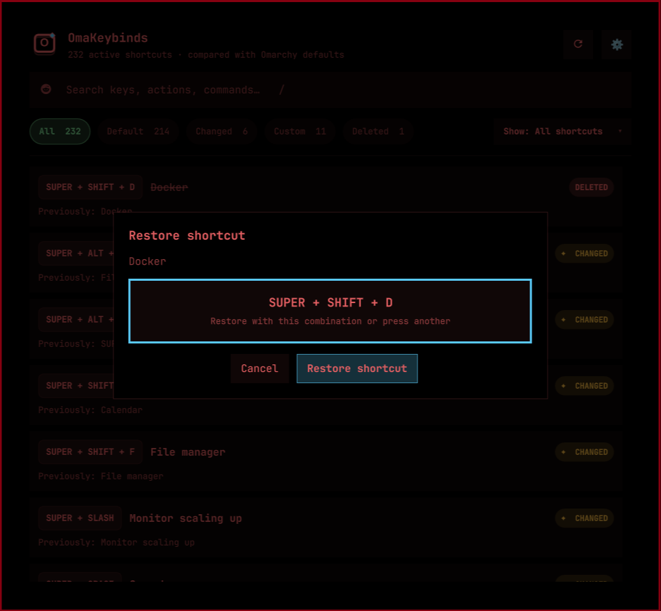

<div align="center">
  
  <h1>OmaKeybinds</h1>
  <p>A taskbar shortcut browser and safe keybinding editor for Omarchy.</p>
</div>



OmaKeybinds is a native Omarchy Shell plugin that puts the keyboard shortcuts
you actually use in one searchable interface. It compares the current Hyprland
configuration with the defaults shipped by your installed Omarchy version, so
you can see what is standard, what changed, and what you added yourself.

## Features

- Theme-aware taskbar icon and popup designed for Omarchy Shell.
- Search by key combination, action, command, or source.
- Filters for **Default**, **Changed**, **Custom**, and **Deleted** shortcuts.
- A `✦` marker on changed and custom entries.
- In-place shortcut editing with physical key capture.
- Conflict warnings that name the actions already using a key; replacement
  requires explicit confirmation.
- A settings menu with a separately confirmed reset to current Omarchy defaults.
- Timestamped backups, Hyprland validation, and automatic rollback for edits.
- No telemetry, accounts, network calls, or background service.

## Runtime dependencies

- A current Omarchy installation with Omarchy Shell plugin support.
- Hyprland and the `hyprctl` command.
- Python 3.10 or newer.

OmaKeybinds uses only Python's standard library. It does not download code or
require any additional Python, system, or AUR packages.

## Install

```bash
omarchy plugin add https://github.com/OddlyCrusty/omakeybinds.git --enable
```

The widget defaults to the right side of the bar. If it is installed but not
visible, enable it explicitly:

```bash
omarchy plugin enable io.github.oddlycrusty.omakeybinds --section right
```

Open OmaKeybinds by selecting its **O keycap** icon in the taskbar.

## Use

The colored count buttons and the **Show** menu select a category. Search is
applied inside the selected category. Keyboard controls are available while the
popup is open:

| Key | Action |
| --- | --- |
| `/` | Focus search |
| `1`–`5` | Show All, Default, Changed, Custom, or Deleted |
| `R` | Rescan shortcuts |
| `Esc` | Close the current dialog or popup |

The categories mean:

- **Default** — active and unchanged from your installed Omarchy defaults.
- **Changed** — a default key now performs another action, or an action moved.
- **Custom** — an active user binding that has no default counterpart.
- **Deleted** — a default binding explicitly unbound without a replacement.

### Change a shortcut

Select an editable row, press the new combination, then select **Apply
shortcut**. When the key is already used, OmaKeybinds lists the conflicting
actions and keeps Apply blocked until you acknowledge the replacement.

Some multi-action or dynamically generated bindings are displayed but are not
editable. This prevents one edit from silently removing sibling actions bound
to the same key.

### Reset every shortcut

Open the cogwheel menu and choose **Reset all shortcuts**. This is intentionally
destructive: it restores `~/.config/hypr/bindings.lua` from the current Omarchy
defaults and removes custom, changed, and deleted shortcuts in that file. A
second confirmation is required. Omarchy creates its normal timestamped backup,
and OmaKeybinds also backs up its state before removing it.

## Safety and files

Scanning is read-only. Editing writes one clearly marked managed block to
`~/.config/hypr/bindings.lua` and stores its small metadata file at
`~/.config/omarchy/omakeybinds-overrides.json`. Before an edit, the bindings
file is copied to `bindings.lua.bak.omakeybinds-<timestamp>`.

After every edit OmaKeybinds reloads Hyprland and checks `hyprctl configerrors`.
If validation fails, the original bindings file is restored automatically. See
[Safety and recovery](docs/SAFETY.md) for recovery commands and exact behavior.

## Update

```bash
omarchy plugin update io.github.oddlycrusty.omakeybinds --yes
```

Release notes are recorded in [CHANGELOG.md](CHANGELOG.md).

## Uninstall

Plugin removal does not implicitly change your personal keybindings. To first
remove only the block managed by OmaKeybinds while preserving all other custom
bindings, run this from the installed plugin directory:

```bash
python3 remove_overrides.py
omarchy plugin remove io.github.oddlycrusty.omakeybinds --yes
```

If you want to keep the bindings you changed with OmaKeybinds, skip the first
command and remove only the plugin.

## Development

From a local repository checkout, run the release checks:

```bash
cd omakeybinds
./scripts/check.sh
```

The check script compiles the Python helpers, runs the unit tests, validates the
manifest, and uses `omarchy plugin validate .` when Omarchy is available.
Architecture and data flow are documented in
[docs/ARCHITECTURE.md](docs/ARCHITECTURE.md). Contributions are welcome; read
[CONTRIBUTING.md](CONTRIBUTING.md) before opening a pull request.

## License

[MIT](LICENSE) © OddlyCrusty
